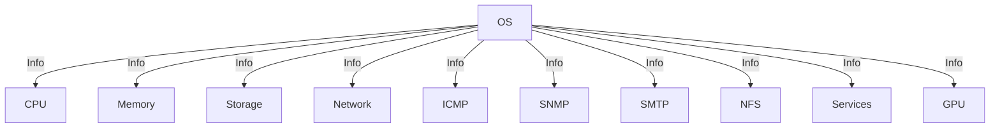

# System Information Report

## OS Information
Darwin Plato.local 24.1.0 Darwin Kernel Version 24.1.0: Thu Oct 10 21:03:11 PDT 2024; root:xnu-11215.41.3~2/RELEASE_ARM64_T6020 arm64

## CPU Information
Apple M2 Max

## Memory Information
Mach Virtual Memory Statistics: (page size of 16384 bytes)
Pages free:                               32977.
Pages active:                            532598.
Pages inactive:                          532080.
Pages speculative:                          244.
...

## Network Information
lo0: flags=8049<UP,LOOPBACK,RUNNING,MULTICAST> mtu 16384
	options=1203<RXCSUM,TXCSUM,TXSTATUS,SW_TIMESTAMP>
	inet 127.0.0.1 netmask 0xff000000
	inet6 ::1 prefixlen 128 
	inet6 fe80::1%lo0 prefixlen 64 scopeid 0x1 
...

## ICMP Information
PING 127.0.0.1 (127.0.0.1): 56 data bytes
64 bytes from 127.0.0.1: icmp_seq=0 ttl=64 time=0.056 ms
64 bytes from 127.0.0.1: icmp_seq=1 ttl=64 time=0.144 ms
64 bytes from 127.0.0.1: icmp_seq=2 ttl=64 time=0.129 ms
64 bytes from 127.0.0.1: icmp_seq=3 ttl=64 time=0.064 ms
...

## SNMP Information

## NFS Information

## Services Information
PID	Status	Label
-	0	com.apple.SafariHistoryServiceAgent
4809	-9	com.apple.progressd
15807	-9	com.apple.cloudphotod
-	-9	com.apple.MENotificationService
...

## GPU Information
Graphics/Displays:

    Apple M2 Max:

      Chipset Model: Apple M2 Max
...

## Components and Services

